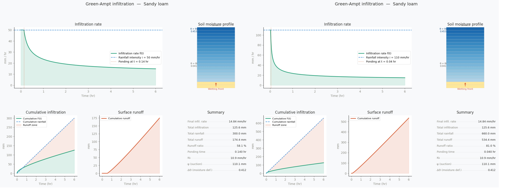
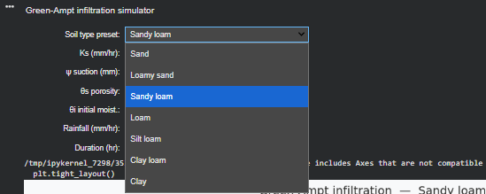
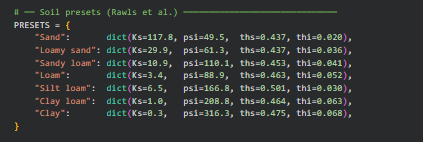

# 🌱 Green-Ampt Infiltration Model Simulator


---

## 1. Overview

This project implements the **Green-Ampt Infiltration Model**, a physically-based hydrological model used to simulate water infiltration into soil over time.

It is widely used in:
- Soil Science  
- Irrigation Engineering  
- Hydrology  

The model balances **physical realism** with **computational simplicity**, making it ideal for both education and practical applications.

### 2. What this project includes:
- Mathematical implementation of the model  
- Numerical solution of implicit equations  
- Interactive visualization  
- Soil-type presets  


---

## 3. Objectives

- Understand infiltration dynamics over time  
- Analyze how soil properties affect infiltration  
- Build an interactive educational simulation  
- Bridge theory with real-world modeling  

**EXAMPLE : Ks Adjsutable**



---

## 3. Why Green-Ampt?

The **Green-Ampt model** is chosen because:

- Physically interpretable (based on soil properties)  
- More realistic than empirical models (e.g., Horton)  
- Widely used in engineering and research  

### 4. Assumptions:
- Sharp wetting front  
- Homogeneous soil  
- Constant rainfall intensity  

## 5. Model Equations

### Infiltration Rate
f(t) = Ks * (1 + (ψ * Δθ) / F(t))

### Cumulative Infiltration
F(t) = Ks * t + ψ * Δθ * ln(1 + F(t) / (ψ * Δθ))

### Parameters:
- **Ks** → Saturated Hydraulic Conductivity  
- **ψ** → Wetting Front Suction Head  
- **Δθ** → Moisture Deficit  
- **F(t)** → Cumulative Infiltration
  


---

## 6. Features

- Interactive sliders (`ipywidgets`)  
- Real-time graph updates  
- Multiple soil presets:
  - Sand  
  - Loamy Sand  
  - Sandy Loam  
- Visualization using Matplotlib  


---

## 7. Soil Presets

Predefined soil parameters based on literature values.

📸 **Screenshot:**


---

## 8. How to Run

```bash
pip install numpy matplotlib ipywidgets
jupyter notebook
```

## 9. Applications
- Irrigation system design  
- Soil-water balance analysis  
- Agricultural planning  
- Hydrological modeling

## 10. Future Improvements

- Add rainfall intensity scenarios  
- Compare with Horton model  
- Export results (CSV)  
- Convert to web app (Streamlit)

## 11. Authors

---

### 👤 Zeyad Mohamed Ali

📧 Emails  
- Primary Email: zeyadmohamedali6@gmail.com  
- Academic Email: agr.ZiadMohamed240623@alexu.edu.eg  

🔗 LinkedIn  
https://www.linkedin.com/in/zeyadmohamedali  

🎓 Affiliation  
Department of Soil and Water Sciences  
Faculty of Agriculture, Alexandria University, Egypt  

---

### 👤 Abdullah Saeed

📧 Email  
- Primary Email: abdowelcome84@gmail.com  

🔗 GitHub  
https://github.com/Abdullah2075  

🔗 LinkedIn  
https://www.linkedin.com/in/abdullah-saeed-b208b23a6  

🎓 Affiliation  
Department of Soil and Water Sciences  
Faculty of Agriculture, Alexandria University, Egypt
---

## 12. Support
If you find this project useful, consider giving it a star ⭐
