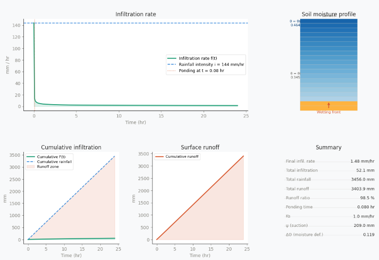
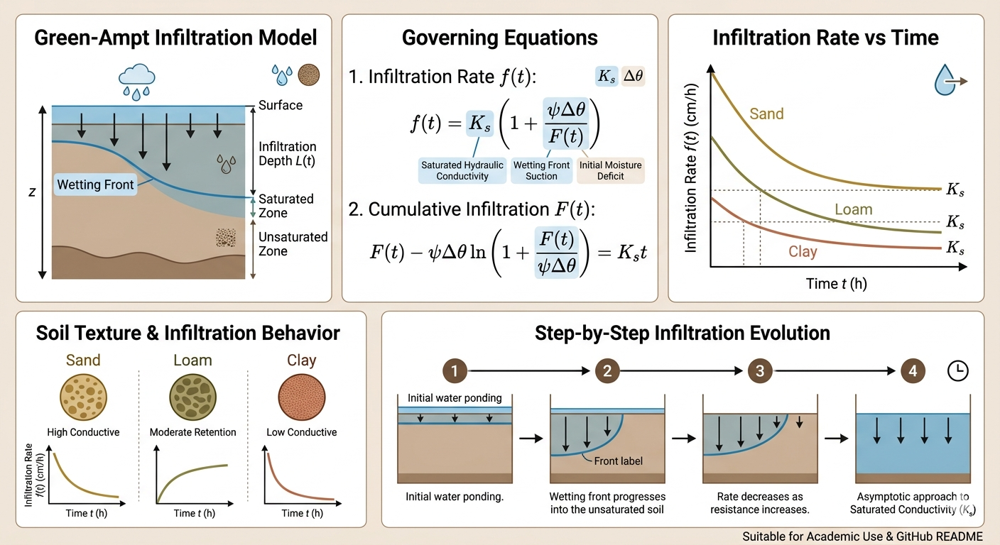

# 🌱 Green-Ampt Infiltration Model Simulator


---

## 📖 Overview

This project implements the **Green-Ampt Infiltration Model**, a physically-based hydrological model used to simulate water infiltration into soil over time.

It is widely used in:
- Soil Science  
- Irrigation Engineering  
- Hydrology  

The model balances **physical realism** with **computational simplicity**, making it ideal for both education and practical applications.

### 🔍 What this project includes:
- Mathematical implementation of the model  
- Numerical solution of implicit equations  
- Interactive visualization  
- Soil-type presets  

📸 **Screenshot:**


---

## 🎯 Objectives

- Understand infiltration dynamics over time  
- Analyze how soil properties affect infiltration  
- Build an interactive educational simulation  
- Bridge theory with real-world modeling  

📸 **Screenshot:**
> صورة توضح اختلاف المنحنيات عند تغيير القيم

---

## 🧠 Why Green-Ampt?

The **Green-Ampt model** is chosen because:

- Physically interpretable (based on soil properties)  
- More realistic than empirical models (e.g., Horton)  
- Widely used in engineering and research  

### 📌 Assumptions:
- Sharp wetting front  
- Homogeneous soil  
- Constant rainfall intensity  

📸 **Screenshot:**
> رسم يوضح wetting front

---

## ⚙️ Model Equations

### Infiltration Rate
f(t) = Ks * (1 + (ψ * Δθ) / F(t))

### Cumulative Infiltration
F(t) = Ks * t + ψ * Δθ * ln(1 + F(t) / (ψ * Δθ))

### Parameters:
- **Ks** → Saturated Hydraulic Conductivity  
- **ψ** → Wetting Front Suction Head  
- **Δθ** → Moisture Deficit  
- **F(t)** → Cumulative Infiltration
  


---

## 🖥️ Features

- Interactive sliders (`ipywidgets`)  
- Real-time graph updates  
- Multiple soil presets:
  - Sand  
  - Loamy Sand  
  - Sandy Loam  
- Visualization using Matplotlib  

📸 **Screenshot:**
> صورة للـ dropdown + الجراف

---

## 📊 Soil Presets

Predefined soil parameters based on literature values.

📸 **Screenshot:**
> صورة للـ table أو الكود

---

## 🚀 How to Run

```bash
pip install numpy matplotlib ipywidgets
jupyter notebook
```

## 📌 Applications
- Irrigation system design  
- Soil-water balance analysis  
- Agricultural planning  
- Hydrological modeling

## 🧩 Future Improvements

- Add rainfall intensity scenarios  
- Compare with Horton model  
- Export results (CSV)  
- Convert to web app (Streamlit)

## 📎 Author

**Zeyad Mohamed Ali** 
**and Abdullah Saeed**

## ⭐ Support
If you find this project useful, consider giving it a star ⭐
